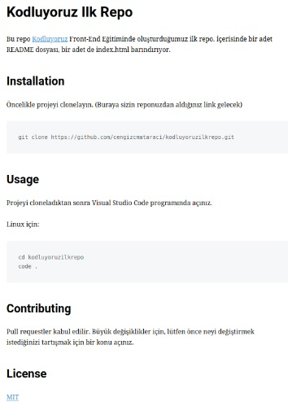

# Kodluyoruz İlk Repo  


Bu repo [kodluyoruz](https://kodluyoruz.org/tr/kodluyoruz/) Front-End eğitiminde oluşturduğumuz ilk repo.İçerisinde bir adet README dosyası, bir adet de index.html barındırıyor.

 # İnstallation

 Öncelikle projeyi clonelayın.
```
git clone https://github.com/medetcandiler/kodluyoruzilkrepo.git
```

# Usage

Projeyi cloneladıktan sonra Visual Studio Code programında açınız.

Linux için:
```
cd kodluyoruzilkrepo
code .
```

# Contributing

Pull requestler kabul edilir. Büyük değişiklikler için, lütfen önce neyi değiştirmek istediğinizi tartışmak için bir konu açınız.

